# IMPLEMENTATION PHASES & UPGRADE ROADMAP (Phases.md)
## Extreme Sales & Services (ESS) — Master Execution Plan
**Timeline**: Under 24 Hours (College Presentation & Production Launch)  
**Status**: Active Execution  

---

## Overview of Milestones

```mermaid
gantt
    title Extreme Sales & Services Rapid Upgrade Roadmap
    dateFormat  HH:mm
    axisFormat  %H:%M
    section Phase 1
    Infra, Git & Multi-Doc Setup :done, p1, 00:00, 30m
    section Phase 2
    3D Interactive AC Simulator & Cost Estimator :active, p2, 00:30, 45m
    section Phase 3
    Technician Signature Pad & Parts Billing :p3, 01:15, 45m
    section Phase 4
    Admin Analytics & Performance Leaderboards :p4, 02:00, 40m
    section Phase 5
    Booking Enhancements & Dynamic AMC Delights :p5, 02:40, 35m
    section Phase 6
    Final Cross-Device Audit & Vercel Verification :p6, 03:15, 30m
```

---

## Phase 1: Infrastructure, Cloud Migration & Core Standard Docs (COMPLETED ✅)
- [x] Migrate repository to GitHub (`https://github.com/Aayu061/extreme-sales-services`).
- [x] Deploy containerized Node.js backend to Render (`srv-dav6st7pn0mc73aeohm0`, `https://extreme-sales-services-gh7s.onrender.com`).
- [x] Connect Google Cloud Firebase Firestore native mode (`extreme-sales-services-8a2b1`).
- [x] Deploy decoupled frontend to Vercel (`https://extreme-sales-services.vercel.app`).
- [x] Seed Firestore collections: `users` (Admin, Staff, Technicians), `products` (18 units), `amc_plans` (3 plans), and initial sample tickets.
- [x] Create project documentation standard: `PRD.md`, `Architecture.md`, `Rules.md`, `Phases.md`, `Design.md`, `Memory.md`.

---

## Phase 2: 3D Interactive Presentation Homepage & Simulator (`index.html`)
- [ ] **Three.js 3D AC Unit Simulator**:
  - Realistic 3D model of an Inverter AC unit mounted on an architectural wall.
  - Interactive mouse drag/touch rotation with smooth inertia.
  - Cooling airflow particle stream with dynamic velocity based on fan speed.
  - Interactive digital temperature display dial (16°C – 28°C) that shifts ambient lighting from cool blue (16°C) to warm neutral (28°C).
  - Mode switcher (Eco Saver, Turbo Cool, Silent Night).
- [ ] **Instant HVAC Service Cost Estimator**:
  - Interactive selector: AC Type (Split / Window / Inverter / Cassette) + Tonnage (1T / 1.5T / 2T) + Issue Type.
  - Real-time estimated bill calculation with tax/GST breakdown and AMC savings comparison.
  - "Book this Service" direct-to-form bridge.
- [ ] **Pincode Serviceability & Fast Booking Bar**:
  - Immediate coverage verification across Mumbai, Navi Mumbai, and Thane metropolitan areas.

---

## Phase 3: Field Technician & Dispatch Upgrades (`technician.html`)
- [ ] **Digital Customer Signature Pad**:
  - HTML5 Canvas signature pad integrated directly into the job completion modal.
  - Clear, undo, and save signature functionality.
- [ ] **Spare Parts & Diagnostics Bill Calculator**:
  - Interactive selector for replacement components:
    - Running Capacitor (₹650)
    - R32/R410A Eco Gas Top-Up (₹1,800)
    - Copper Tube Brazing / Flare Joint (₹850)
    - Blower Motor Replacement (₹2,200)
    - Magnetic Contactor Relay (₹750)
  - Live subtotal calculation with 18% GST and AMC discount deduction.
- [ ] **Printable Job Sheet / Digital Receipt**:
  - Clean receipt modal with invoice number, technician name, customer signature, and itemized billing breakdown.

---

## Phase 4: Admin & Analytics Improvements (`admin.html`)
- [ ] **Revenue & Profit Margin Calculator**:
  - Real-time gross revenue, service parts cost, technician commission, and net operating profit metrics.
- [ ] **Technician Performance Leaderboard**:
  - Ranked cards showing completed jobs, on-time response rate, and customer satisfaction star ratings.
- [ ] **Instant Data Export (CSV & Print Report)**:
  - Client-side CSV generator for service tickets, active AMCs, and financial summaries.

---

## Phase 5: New Customer & Booking Features (`service.html`, `status.html`)
- [ ] **Preferred Time-Slot Scheduler**:
  - Morning (9 AM - 12 PM), Afternoon (12 PM - 3 PM), Evening (3 PM - 7 PM), and Emergency 2-Hour Express Dispatch.
- [ ] **Dynamic AMC Delight Banner Enhancement**:
  - Interactive animation highlighting ₹0 billable amount when phone matches active AMC.
- [ ] **Post-Service Rating & Verified Review Feed**:
  - Real-time review publication into `/api/feedback` displayed on `contact.html`.

---

## Phase 6: Final Verification, Cross-Device Audit & Deployment
- [ ] Execute automated verification test suite across all API endpoints.
- [ ] Verify zero console errors on Vercel deployment.
- [ ] Git commit and push all updates to GitHub `origin/main`.
